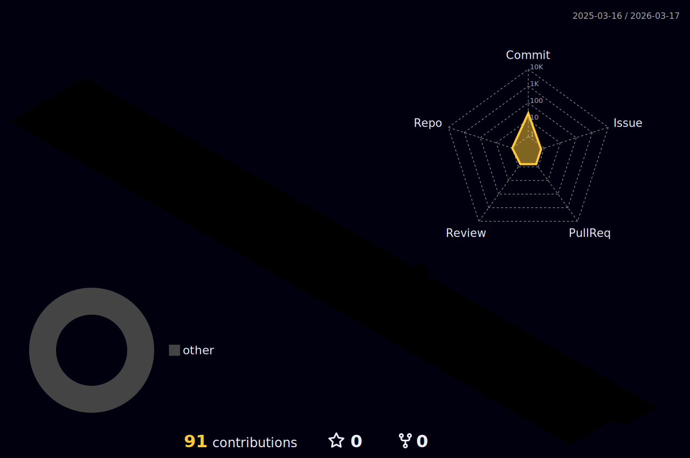

<!--
**RatheNot/RatheNot** is a ✨ _special_ ✨ repository because its `README.md` (this file) appears on your GitHub profile.

Here are some ideas to get you started:

- 🔭 I’m currently studying for an AI Engineer's degree
- 🌱 I’m currently learning Math, C, Python libs
- 👯 I’m looking to collaborate on AI agent project (no salary or any money, just for fun)
- 🤔 I’m looking for help with Linear math and Mathematical analysis, if you know something, please, dm me.
- 💬 Ask me about nothing. I would not answer.
- 📫 How to reach me: e-mail, telegram.
- 😄 Pronouns: ????
- ⚡ Fun fact: Ingredients:
                Sifted wheat flour - 500 g + extra for working with the dough
                Hot water (70-75 degrees Celsius) - 250 ml
                Egg (small) - 1 pc.
                Salt - 1 level teaspoon
                Odorless vegetable oil - 25 ml
                *
                For the filling:
                Meat (beef and pork) - 550 g
                Onion - 200 g
                Lard (optional, if lean meat) - 30 g
                Water - 70-80 g (depending on the consistency of the minced meat)
                Salt - 1 level teaspoon
                Ground black pepper - to taste
                *
                For cooking:
                Bay leaf - to taste
                Salt - to taste
                Black peppercorns - to taste
                Onion - 1/4 pc.
                *
                For serving:
                Butter - to taste
-->
